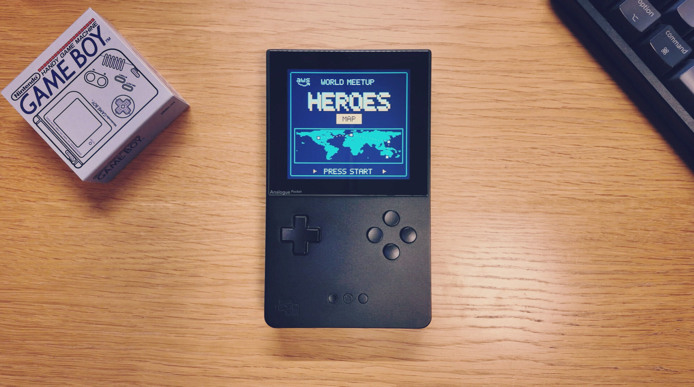
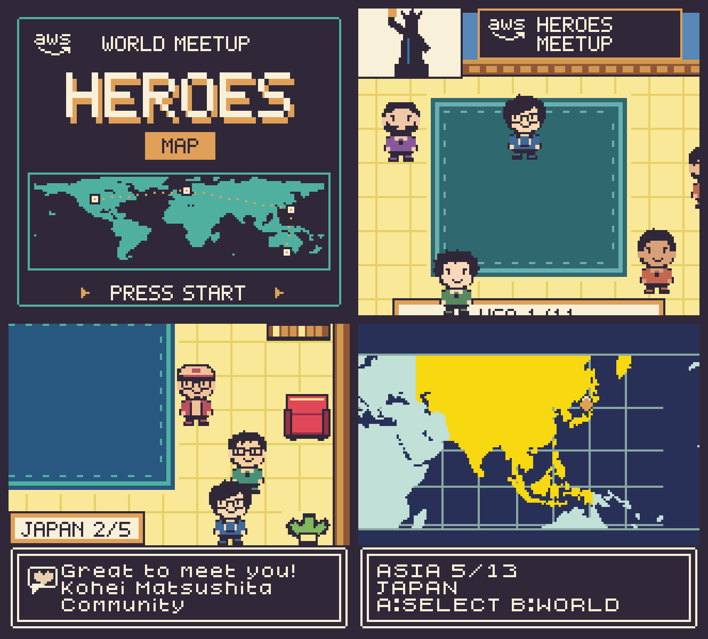

# AWS Heroes World Meetup

Read this in other languages: [Japanese](./README_ja.md)

Meet AWS Heroes around the world in a Game Boy Color game inspired by [AWS Heroes Map](https://heroes.dayjournal.dev). This game was created using the ModRetro Chromatic Plugin in Codex.

[Download ROM](https://github.com/dayjournal/aws-heroes-world-meetup-gbc/releases) · [How to play](#how-to-play) · [Controls](#controls)

## About

## Download

Download the game ZIP from [Releases](https://github.com/dayjournal/aws-heroes-world-meetup-gbc/releases), extract it, and open the `.gbc` file in a compatible emulator or on compatible hardware.

## How to play

1. Open the `.gbc` file in your chosen Game Boy Color-compatible environment.
2. Press **START** on the title screen and select **World journey**.
3. Choose **Hero**, **AWS employee**, or **Community**. If you enter a name, press **START** to confirm it.
4. Choose a region and country on the world map.
5. Walk around the hall, face a Hero, and press **A** to say hello.

## Controls

| Button | Action |
| --- | --- |
| D-pad | Move / select |
| A | Talk / confirm / use a doorway |
| B | Back in menus / hold while moving to run |
| START | Open the menu |
| SELECT | Open group photo options |

## License

MIT

Copyright (c) 2026 Yasunori Kirimoto
